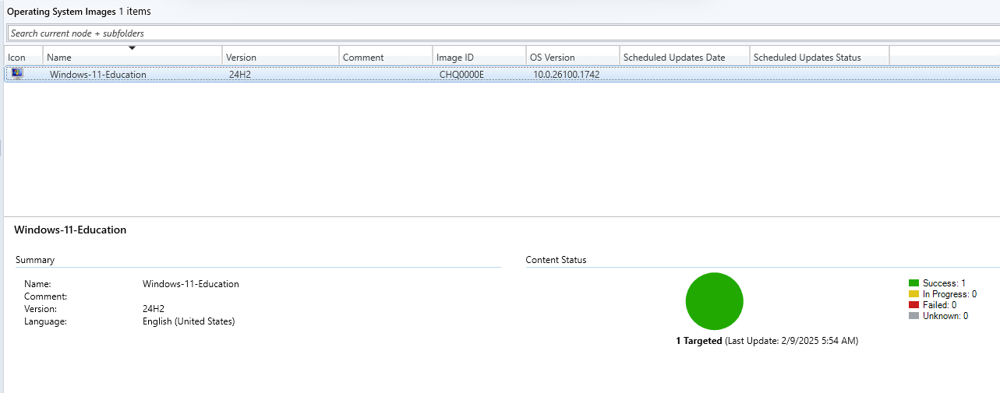

### Step 1: Create a Device Collection
1. Open Configuration Manager Console.
2. Navigate to Assets and Compliance > Device Collections.
3. Right-click Device Collections and choose Create Device Collection.
4. Enter a name for your collection (e.g., "Windows 11 Deployment").
5. Under Limiting Collection, select All Systems (or another collection depending on your setup).
6. Click Next and complete the wizard.
7. Double click on the "Windows 11 Deployment" to check if the target node is present. Should be look like this:


### Step 2: Create an Operating System Image
1. Obtain the Windows 11 ISO (latest version).
2. Mount the ISO on your MCM server.
3. Copy the contents of the ISO to the local directory of your MCM server. In my case:
    ```
    C:\Packages\win11_package\
    ```
4. Right-click Operating System Images and select Add Operating System Image.
5. In the wizard, browse to the install.wim file from the mounted ISO. Should be a UNC path like this:
    ```
    \\CM1\Packages$\win11_package\sources\install.wim
    ```
6. Check the EULA (By checking this box you...)
7. Check the Extract a specific image index from the specified WIM file and select Windows 11 Education in the Image index then click Next.
    
8. In the Pre-cache settings, select Enlgish (United States) for the Language and x64, arm64 for the Architecture then keep clicking Next until Completion.

### Step 3: Distribute the Operating System Image to Distribution Points
1. In the Operating System Images node, select your newly created Windows 11 image.
2. Right-click and select Distribute Content.

    

3. Select the distribution points or distribution point groups where you want the image to be available.

    

3. Click Next and then Close when the process completes. Whate for the Content Status to become sucessful.

    

