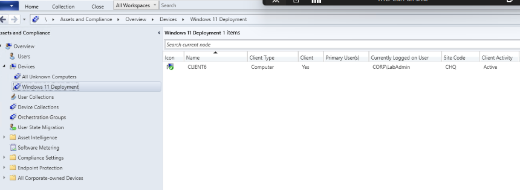
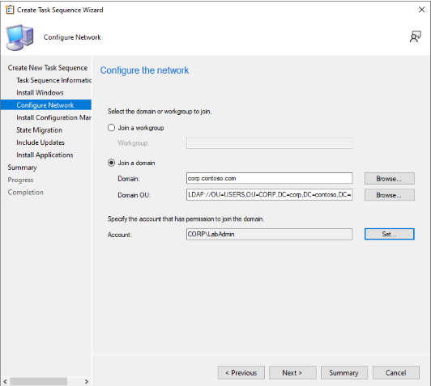

## Overview: Windows 11 Deployment Using SCCM
This guide outlines the step-by-step process to deploy **Windows 11** to client machines using **Microsoft Configuration Manager (MCM).** The use of an **answer file (unattend.xml)** in the task sequence helps streamline the installation by automating system configurations such as language, region, and user settings. Meanwhile, the task sequence itself is responsible for connecting machines to the Active Directory (AD) domain by specifying domain join credentials and organizational units (OUs).

### Step 1: Create a Device Collection
1. Open Configuration Manager Console.
2. Navigate to **Assets and Compliance > Device Collections.**
3. Right-click **Device Collections** and choose **Create Device Collection.**
4. Enter a name for your collection (e.g., "Windows 11 Deployment").
5. Under Limiting Collection, select All Systems (or another collection depending on your setup).
6. Click Next and complete the wizard.
7. Double click on the "Windows 11 Deployment" to check if the target node is present. Should be look like this:



### Step 2: Create an Operating System Image
1. Obtain the Windows 11 ISO (latest version).
2. Mount the ISO on your MCM server.
3. Copy the contents of the ISO to the local directory of your MCM server. In my case, I copy it to a newly created directory:
    ```
    C:\Packages\win11_package\
    ```
4. Right-click Operating System Images and select Add Operating System Image.
5. In the wizard, browse to the install.wim file from the directory that you created. Should be a UNC path like this:
    ```
    \\CM1\Packages$\win11_package\sources\install.wim
    ```
6. Check the EULA (By checking this box you...)
7. Check the Extract a specific image index from the specified WIM file and select Windows 11 Education in the Image index then click Next.

    

8. In the Pre-cache settings, select Enlgish (United States) for the Language and x64, arm64 for the Architecture then keep clicking Next until Completion.

### Step 3: Distribute the Operating System Image to Distribution Points
1. In the Operating System Images node, select your newly created Windows 11 image.
2. Right-click and select **Distribute Content.**
   
    

3. Select the distribution points or distribution point groups where you want the image to be available.
    
    

4. Click Next and then Close when the process completes. Wait for the Content Status to become sucessful.
   
    

### Step 4: Distribute the Boot Images
1. Navigate to **Software Library > Operating Systems > Boot Images.**
2. Right-click the desired Boot Image (e.g., x64) and select **Distribute Content.**

    

3. Select the same distribution points as for the OS image.
4. Click Next and Close when done.

    


### Step 5: Create a Package for the Answer File
1. Navigate to **Software Library > Application Management > Packages.**
2. Right-click Packages and select **Create Package.**

    

3. Name the package (e.g., "Windows 11 Answer File") and specify the source folder containing the unattend.xml answer file.

    

4. In the Program Type, select **Do not create a program.**
5. Follow the wizard to complete the creation.
6. Ensure that the package is available on your distribution points by doing steps 3 or 4.

    

### Step 6: Create a Task Sequence
1. Navigate to **Software Library > Operating Systems > Task Sequences.**
2. Right-click Task Sequences and select **Create Task Sequence.**

    

3. Choose Install an existing image package and click Next.
4. Enter a name (e.g., "Windows 11 Mass Deployment") and a description, then select the Boot Image, then click Next.

    

5. Select the previously created Windows 11 Image and configure the settings, such as disk partitioning, BitLocker settings, local Admin password then click Next.

    

6. In the Configure the network, since we want this machine to be automatically enrolled in our Active Directory, click on the Join a domain. Browse the Domain (e.g. corp.contoso.com) and select the Domain OU. Specify the account that will be used to join the domain. **Make sure to verify the connection before proceeding.**
    
    

7. In the Install Configuration Manager client, click Next. **We want this machine to be installed with CM client after the OS install, so we can immediately monitor it.**
8. In the Configure state migration, **uncheck Capture user settings and files** then click Next until completion.

    

    #### Step 6.1: Adding the answer file to the Task Sequence.
    1. Right-click on the created task sequence and select **Edit**.
    2. Navigate to **Install Operating System > Apply Operating System**.
    3. Check the **Use an unattended or Sysprep answer file...**
    4. Browse the created package (e.g. Windows 11 Answer FIle).
    5. And select the file name of the answer file, then click Apply.
        
        

### Step 7: Distribute and Deploy the Task Sequence:
1. The same with steps 3 and 4, distribute the task sequence by right-clicking on it and selecting **Distribute Content.**
2. To deploy the task sequence, right click on it and select **Deploy**.

    

3. Choose the Device Collection (e.g., "Windows 11 Deployment") to target.
4. Select Deploy this task sequence to the collection and set the deployment purpose to Available or Required. For our case, I selected Available since we will install it via Software Center of the client machine.
5. I left the remaining settings to default and click Next until Completion.
    
    

### Deployment on the Client Machines
1. Navigate to **Software Center > Operating Systems**.
2. Select the Windows 11 Mass Deployment and clik **Install**.

    

3. The CM will initiate the install and apply the settings that we configured in our Task Sequence such as, installing Windows 11, joining the machine to the domain, applying the settings in our answer file and installing the Configuration Manager client.

    

    

    

4. Navigate to the Configuration Manager > Devices if the client machine successfully communicated back.

    

## Final Notes:
- Make sure that your Windows 11 image, boot images, answer file package, and the task sequence are available on all necessary distribution points.
- Ensure the answer file is correctly configured for the specific deployment environment (e.g., region, language settings, etc.).
- The Task Sequence should be tested on a small group of machines before wide deployment.